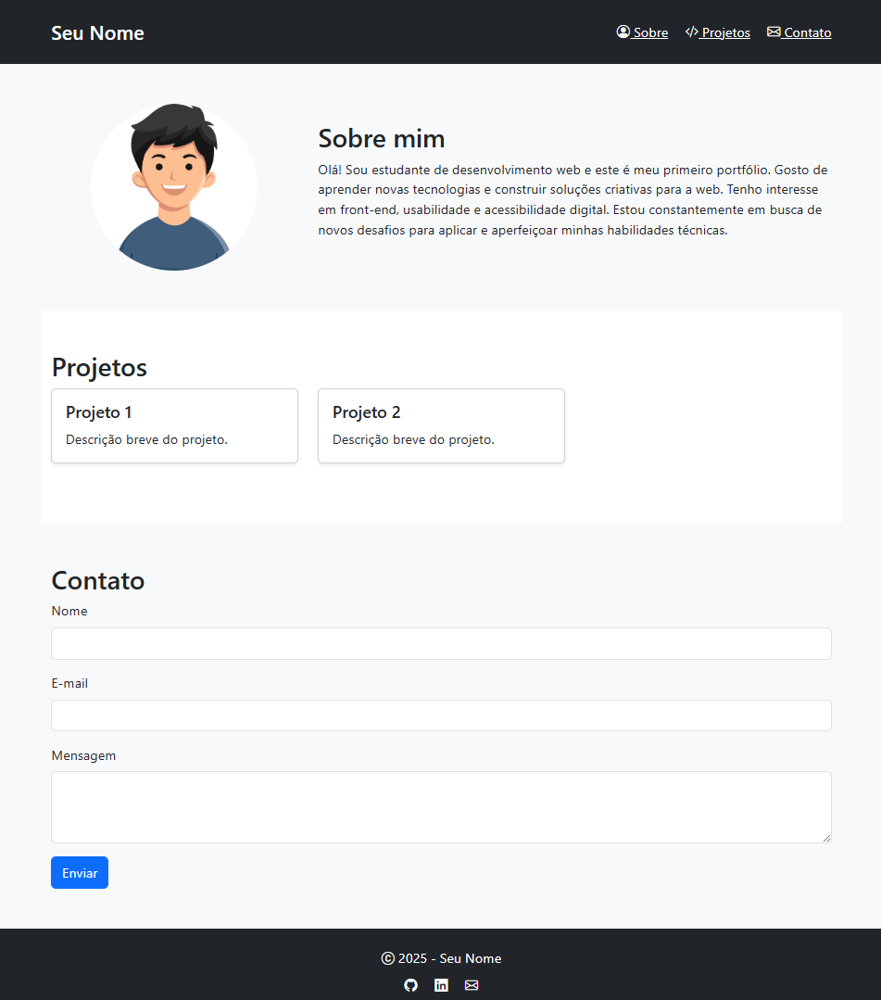

# Portfólio Web - Exemplo

Este projeto é um exemplo de portfólio pessoal desenvolvido com HTML e CSS. O objetivo é apresentar de forma simples suas habilidades, projetos e canais de contato.

## 💻 Demonstração

Abaixo, você pode visualizar uma prévia da página final:



## 📁 Arquivos incluídos

- `index.html`: Estrutura da página do portfólio.
- `sua-foto.png`: Imagem de perfil usada na seção "Sobre mim".
- `README.md`: Este arquivo com instruções e visualização do projeto.

## ✨ Funcionalidades

- Seção "Sobre mim" com foto e descrição.
- Exibição de projetos com breve descrição.
- Formulário de contato funcional.
- Rodapé com links para redes sociais.

## Como visualizar

Você pode abrir o arquivo `index.html` diretamente no navegador:

```bash
git clone https://github.com/seu-usuario/portfolio-web-exemplo.git
cd portfolio-web-exemplo
abrir index.html
